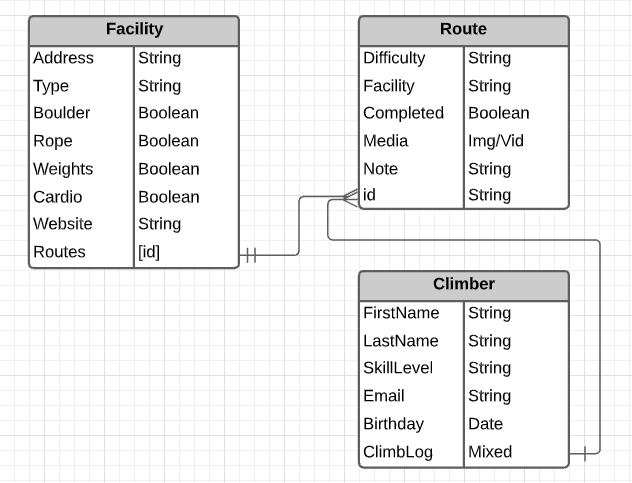
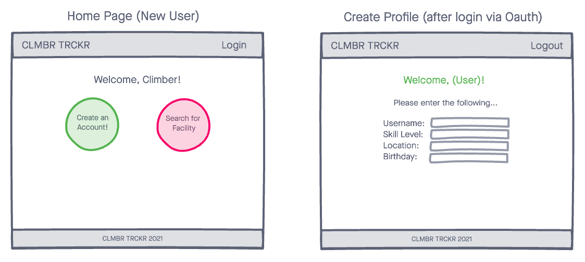
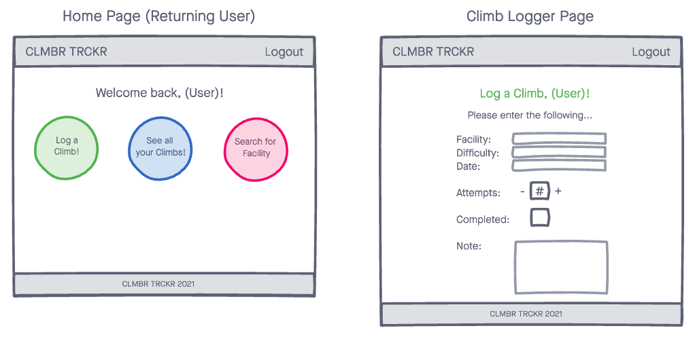
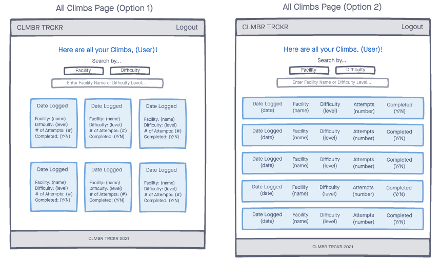
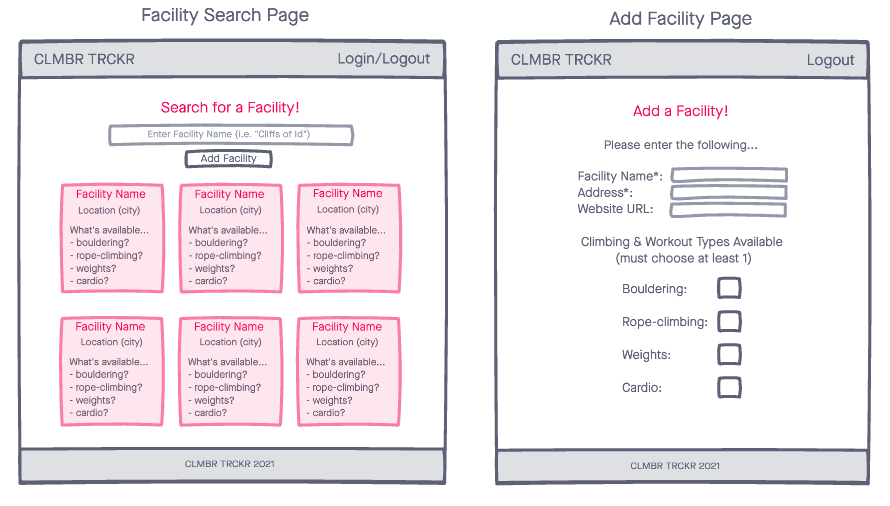
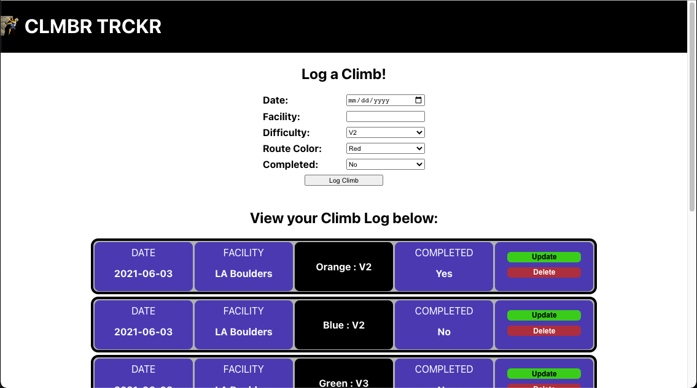

# CLMBR TRCKR - Fitness Tracker for Climbing/Bouldering
Welcome to the fitness tracker application specifically designed for tracking your progress as you develop your skills, strength, and stamina through climbing! **CLMBR TRCKR** allows users to log climbs with information such as:
- _Date_ attempted.
- Climbing Facility.
- Climb _Difficulty_ and _Color_. 
- _Completion Status_. 
- Ability to _Update_ and _Delete_ logged climbs as needed. 
- Much more to come!!! 

## Technologies
- JavaScript
- React
- Express
- Mongoose
- Node
- MongoDB
- HTML5
- CSS3

## ERD

## Wireframes
### Home Page (New User) - Log a Climb

### Home Page (Returning User) - Create a Profile

### Climb Log

### Add Facility & Facility Search

## Screenshots
### Iteration #1

## Getting Started
[Click here to start tracking your climbing progress!](https://clmbr-trckr.netlify.app/)

## Unsolved Problems
1. Having an issue toggling checkbox between **true** and **false** for climb completion status. (_What's up my Booleans?_)

## Future Enhancements
1. Add authentication and authorization through Firebase. 
2. Add client-side routing. 
3. Consume Google Directions API to guide users to nearest Climbing Facility. 
4. Allow users to upload media (pictures and videos) of routes completed/working on.  